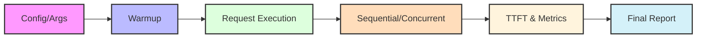

---

As a developer, I've long suffered from **developer information overload**. I want to keep up with the latest tech trends on GitHub, Hugging Face, and Product Hunt, but I invariably end up wasting hours filtering out the fluff. I tried **RSS feed alternatives** and various content aggregators, but they merely turned "doomscrolling Twitter" into "clearing hundreds of unread links"—treating the symptoms, not the root cause.

To save my attention span, I built **TechDistill**, an **automated AI summary tool**. 

Simply put, I hired a tireless AI assistant. Every day, it goes straight to the sources to scrape trending projects, scrubs away the messy code and marketing jargon, and tells me exactly "what this thing actually is" in plain English.

I've now completely quit endless tech news feeds. I just spend 3 minutes over my morning coffee skimming the "Daily Overview," diving into the detailed reports only if something catches my eye.

Best of all, the entire workflow relies on **serverless automation with GitHub Actions**. It requires zero server maintenance, and **running this automated daily execution for a whole year costs just $3**.

This minimalist, low-noise AI automated workflow has been running stably for over 10 days. Today, I want to share how it was built. Even if you're not a professional programmer, you’ll find it easy to follow.

### Phase 1: Infrastructure - Securing "Mining Permits" and Configuring the "Ignition Key"

Before firing up this "information distillery," we first need to secure data access permissions and configure them locally or in the cloud. We need to obtain Access Tokens for GitHub, Hugging Face, and Product Hunt, alongside an **OpenRouter API key** for calling Large Language Models (LLMs).

For security purposes, these sensitive credentials cannot be hardcoded into the script. They must be safely protected by setting up environment variables.

Think of it like building a fully automated digital alchemy factory: First, you must issue **"mining permits"** (Access Tokens) to your automated mining vehicles and mandate exactly where these confidential permits are stored (environment variables); simultaneously, you must equip the core smart smelting furnace with a **"high-energy ignition key"** (LLM API Key). Only when both the permits and the ignition key are in place can your automated data processing pipeline truly get authorization and roar to life.

### Phase 2: Data Collection - Deploying Automated Mining Vehicles (Spiders & Collection)

Once the environment variables are configured, the system officially enters the automated data collection phase. TechDistill deploys a dedicated fleet of web scraping spiders scheduled to daily visit the three major tech frontiers: GitHub Trending repositories, popular Hugging Face AI models, and highly upvoted Product Hunt posts.

The scraping process is far from just skimming the surface. After retrieving the surface-level titles, the crawlers dig deeper for comprehensive web data extraction: fully extracting GitHub README files, fetching Hugging Face Model Cards, and pulling the complete post bodies and detailed product descriptions from Product Hunt.

You can picture this step as a fleet of AI-powered web scrapers operating like smart unmanned mining vehicles. First, the machines quickly shovel up the "open-pit surface ores" (titles and summaries). Then, they activate their deep scanners to precisely locate and heavily mine the "high-grade ore veins" (full documentation) hidden deep underground. Ultimately, both the surface raw ores and the deep high-grade concentrates are loaded together into heavy mining trucks. Fully loaded, they are continuously transported to the next processing station, ensuring an abundant supply of high-quality raw materials for the subsequent "digital alchemy" and structured data analysis.

### Phase 3: Core Pipeline - Ore Aggregation and Sorting Conveyor Belt (Core Pipeline)

When the mining vehicles return fully loaded, the project's internal `core` module officially takes over. Raw data from this **multi-source aggregation** is centralized, aligned, and prepped for the next stage.

When dealing with massive amounts of data, efficiency and stability are the lifelines of the pipeline. To prevent useless data from interfering with the AI processing, I set up a lightweight **data cleaning mechanism** in the `utils` module—filtering out noise, extracting key content, and truncating overly long texts—which is then utilized by the `core` module.

You can visualize this step as the "gravel sorting conveyor belt" in a refinery. Raw ores of various shapes from different mining zones are unloaded onto the belt, where a sorting and filtering system (the data cleaning mechanism) conducts a **preliminary screening**. The system accurately judges which ores have a high gold content and **which ones** are worthless, picking out appropriately sized rocks to methodically guarantee the high efficiency of the entire scraping and aggregation pipeline.

### Phase 4: Noise Reduction Core - Feeding the Smart Smelting Furnace (AI Analysis)

This is the most critical and hardcore step where TechDistill achieves true "noise reduction." Despite the initial data cleaning, plenty of hard-to-understand marketing fluff and jargon inevitably remains.

At this point, based on the information's origin, the system utilizes customized prompt templates designed specifically for different sources to more efficiently call the **AI API services provided by OpenRouter**, ensuring highly accurate and structured output results for every run.

In our digital alchemy factory, these customized prompt templates and AI services make up the "smart smelting furnace." This intelligent furnace precisely controls the temperature and processing flow based on the specific type of ore, ruthlessly burning away the fluff, impurities, and marketing bubbles at high temperatures. Ultimately, it extracts pure "information gold."

### Phase 5: Output Delivery - Ingot Storage and Dedicated Logistics (Delivery)

After deep AI noise reduction and refinement, all high-value information is ready. Next, the system converts these results into the most user-friendly, easily consumable format, completing the final information delivery.

TechDistill automatically generates four cleanly formatted, well-structured **Markdown reports** in the local `reports` directory, organized by batch. One is `overview.md` (Global Overview), designed to let you grasp the day's tech trends in under two minutes. The other three are detailed specific reports targeting GitHub, Hugging Face, and Product Hunt. Furthermore, if you have configured a **Telegram Bot integration**, the system will push these reports directly to your mobile device.

In our digital refinery, this step is the final "ingot storage and dedicated logistics." The refined information gold is uniformly packaged into standardized gold bars (Markdown reports) and neatly placed into the factory's exclusive vault (the batch directory) for easy browsing, global search, and long-term archiving. The equipped dedicated logistics network then delivers the freshly minted gold bars straight to your personal safe.

### Important Notes

If you plan to **run this automated workflow on GitHub Actions**, please avoid using any free LLM models; opt for low-cost paid models instead. When I ran my Time-to-First-Token (TTFT) throughput test file on GitHub Actions, I found that free models completely failed to respond. The tests only passed after switching to a paid model API. 

Below is the flowchart for my test file：

  

The following are the test results using the free model and the low-cost paid model, respectively:

FREE MODEL:

LOW-COST PAID MODEL:

GITHUB LINKS: https://github.com/JunstinLee/TechDistill
